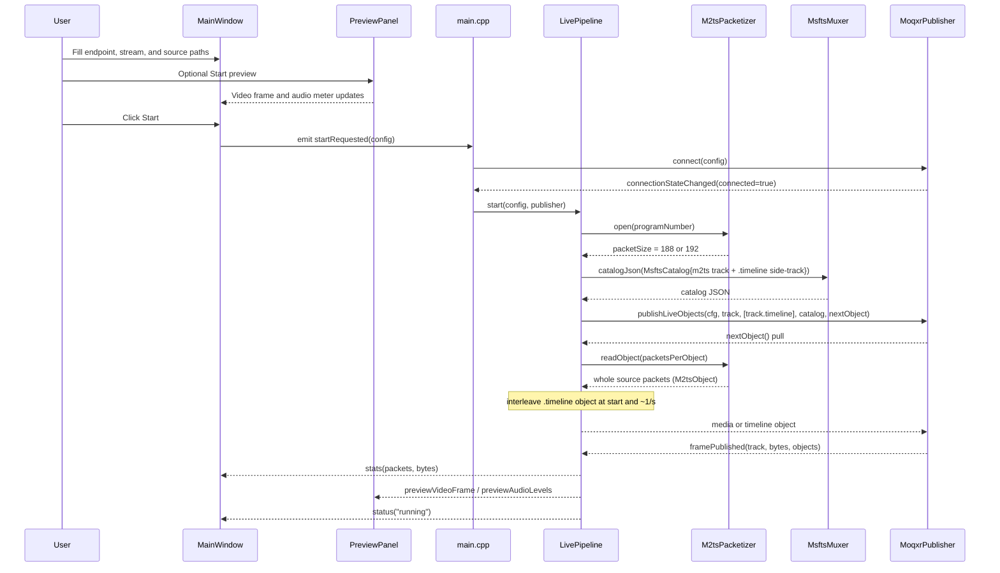
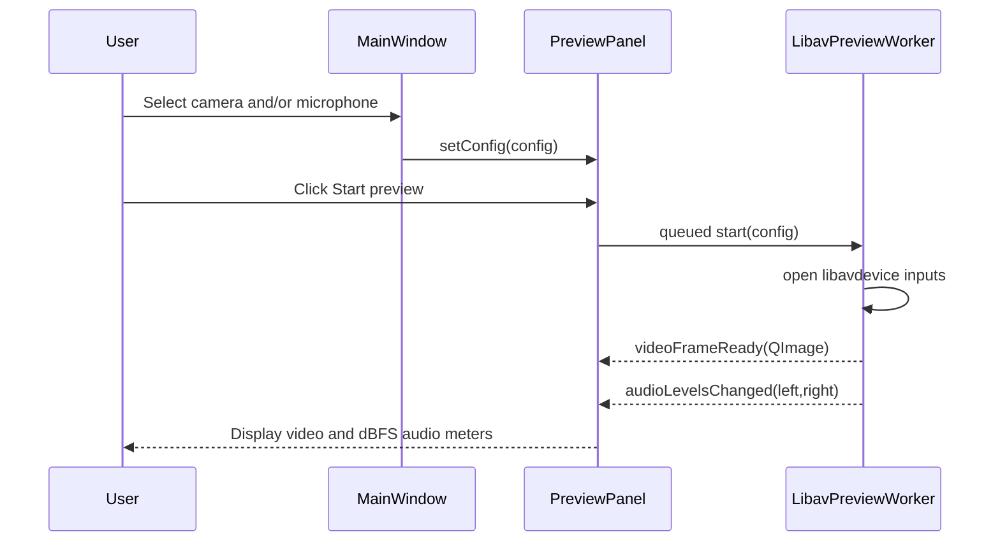
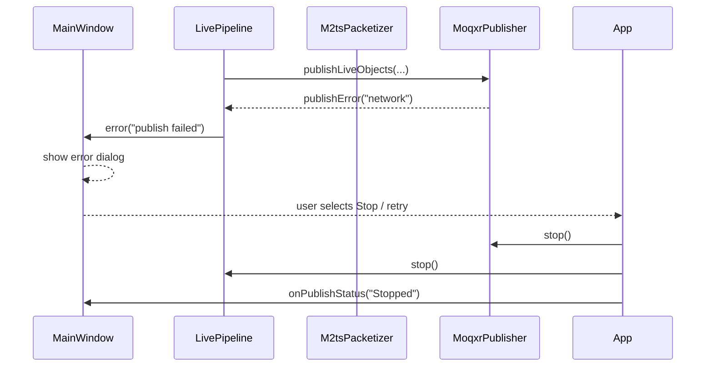
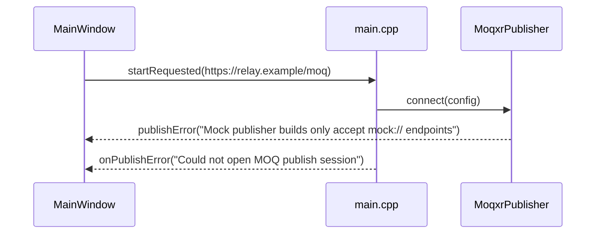
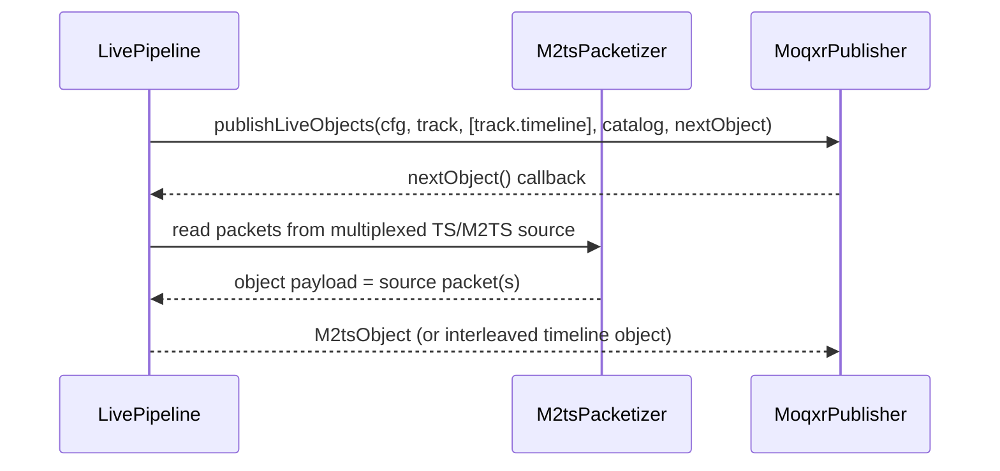
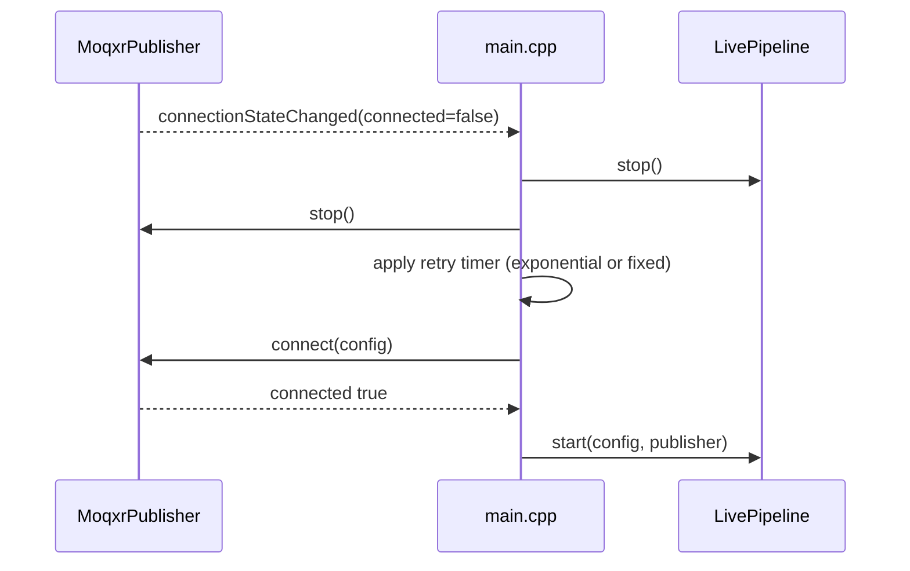

# Sequence Diagrams — MOQ2TS Publisher

## 1) Live publish startup and first fragments

## 1a) Preflight capture preview

## 2) Error path and fallback

## 2a) Mock build with real relay URL

## 3) Media track handling

## 4) Reconnect strategy (recommended extension point)

