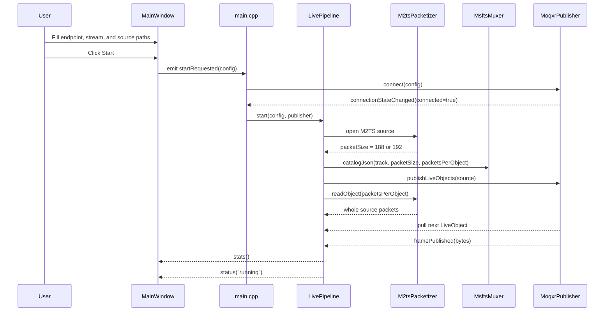
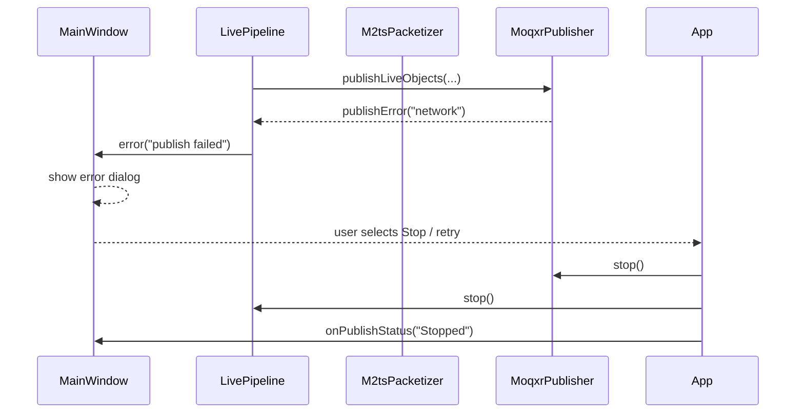
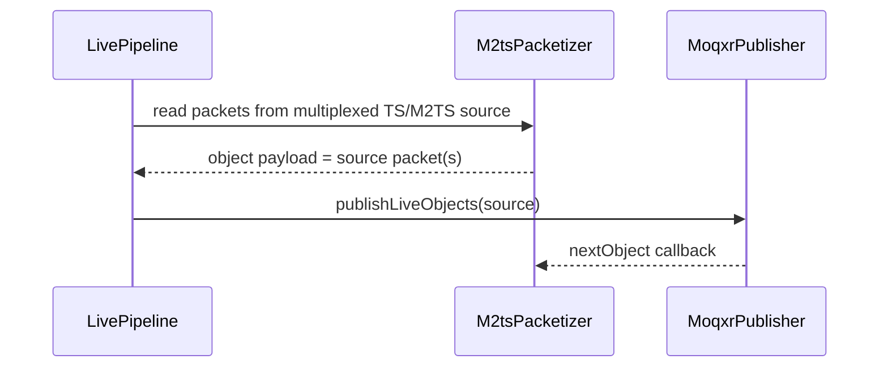
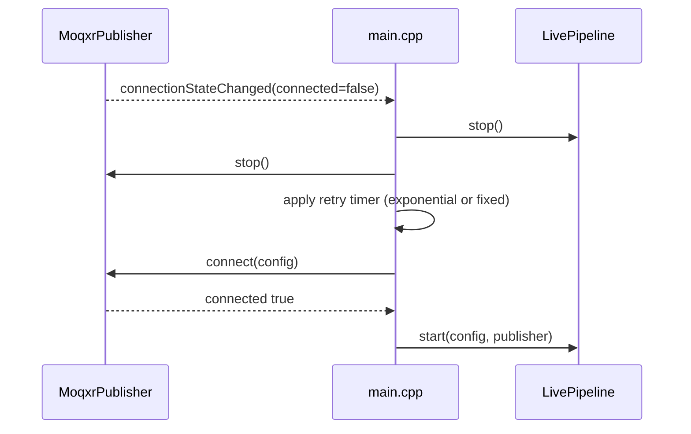

# Sequence Diagrams — MOQ2TS Publisher

## 1) Live publish startup and first fragments

## 2) Error path and fallback

## 3) Media track handling

## 4) Reconnect strategy (recommended extension point)

